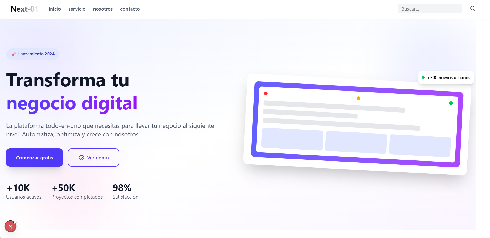
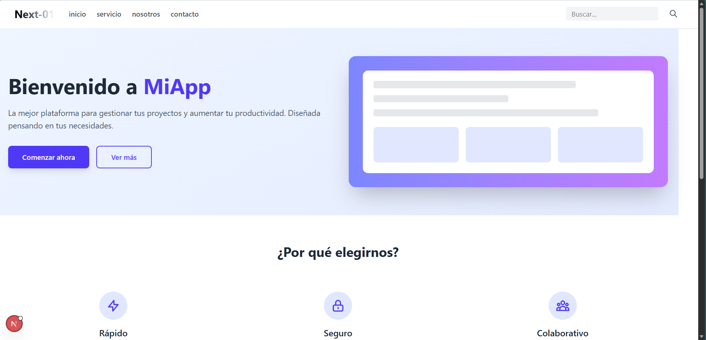
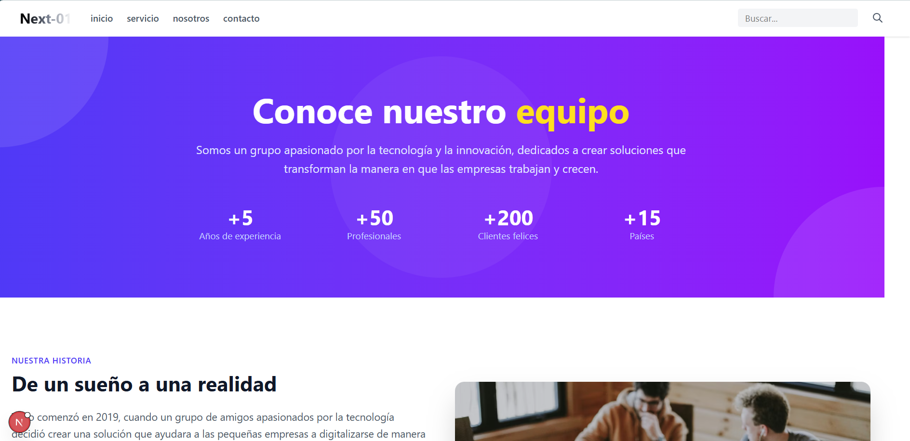
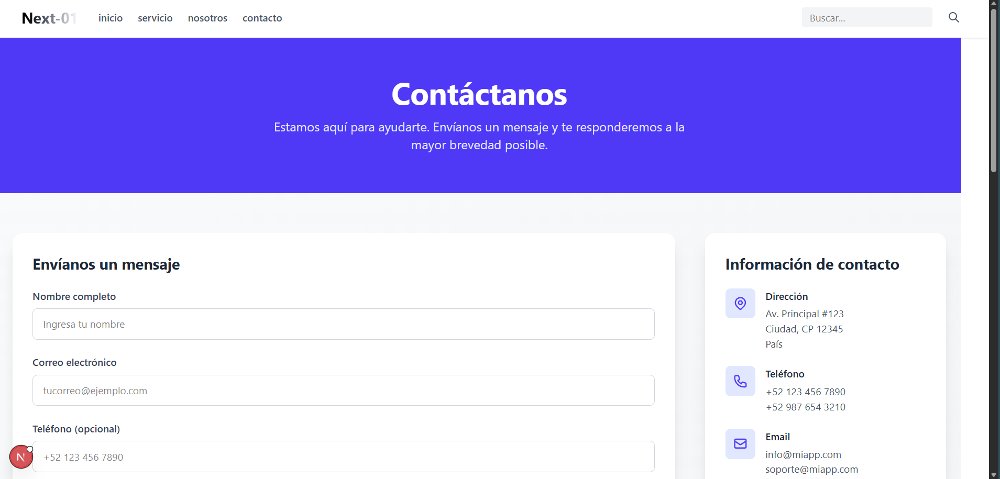
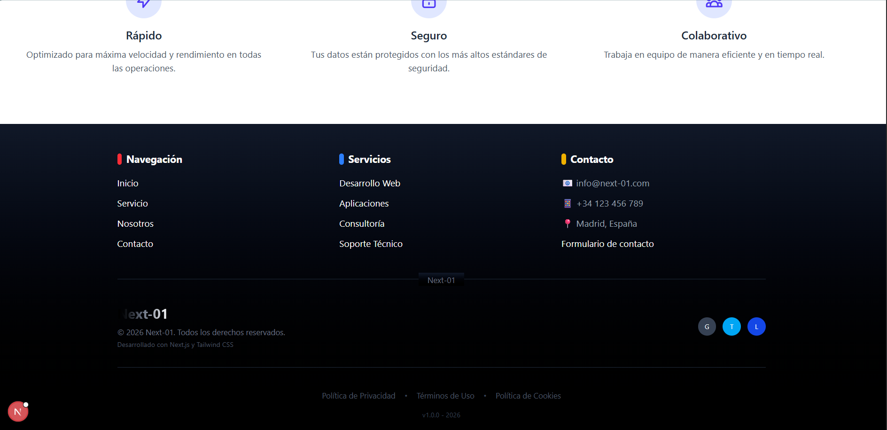

# Proyecto 01

Este es un proyecto desarrollado con [Next.js](https://nextjs.org/) que incluye una estructura básica para una aplicación web con varias páginas y componentes reutilizables.

## Estructura del Proyecto

El proyecto tiene la siguiente estructura principal:

```
proyecto-01/
├── public/                # Archivos estáticos
├── src/
│   ├── app/
│   │   ├── globals.css   # Estilos globales
│   │   ├── layout.js     # Diseño base de la aplicación
│   │   ├── page.js       # Página principal
│   │   ├── (paginas)/    # Subdirectorios para páginas específicas
│   │   │   ├── contacto/ # Página de contacto
│   │   │   ├── nosotros/ # Página de nosotros
│   │   │   ├── servicio/ # Página de servicios
│   ├── components/       # Componentes reutilizables
│       ├── Footer.js     # Componente de pie de página
│       ├── Navbar.js     # Componente de barra de navegación
├── package.json           # Configuración del proyecto y dependencias
├── next.config.mjs        # Configuración de Next.js
├── postcss.config.mjs     # Configuración de PostCSS
├── eslint.config.mjs      # Configuración de ESLint
```

## Dependencias

El proyecto utiliza las siguientes dependencias principales:

- `next`: ^16.1.6
- `react`: ^19.2.3
- `react-dom`: ^19.2.3

### Dependencias de desarrollo

- `@tailwindcss/postcss`: ^4
- `babel-plugin-react-compiler`: 1.0.0
- `eslint`: ^9
- `eslint-config-next`: 16.1.6

## Scripts Disponibles

En el archivo `package.json` se incluyen los siguientes scripts:

- `dev`: Inicia el servidor de desarrollo.
- `build`: Genera una versión optimizada para producción.
- `start`: Inicia el servidor en modo producción.
- `lint`: Ejecuta ESLint para analizar el código.

## Cómo Ejecutar el Proyecto

1. Clona este repositorio:

   ```bash
   git clone <URL_DEL_REPOSITORIO>
   ```

2. Instala las dependencias:

   ```bash
   npm install
   ```

3. Inicia el servidor de desarrollo:

   ```bash
   npm run dev
   ```

4. Abre tu navegador y ve a `http://localhost:3000`.

## Tareas Realizadas

- [x] Crear el componente de barra de navegación.
- [x] Crear el componente de pie de página.
- [x] Configurar el enrutamiento para las páginas.
- [x] Renderizar las páginas para verificar su contenido.

## 📷 Capturas de pantalla








